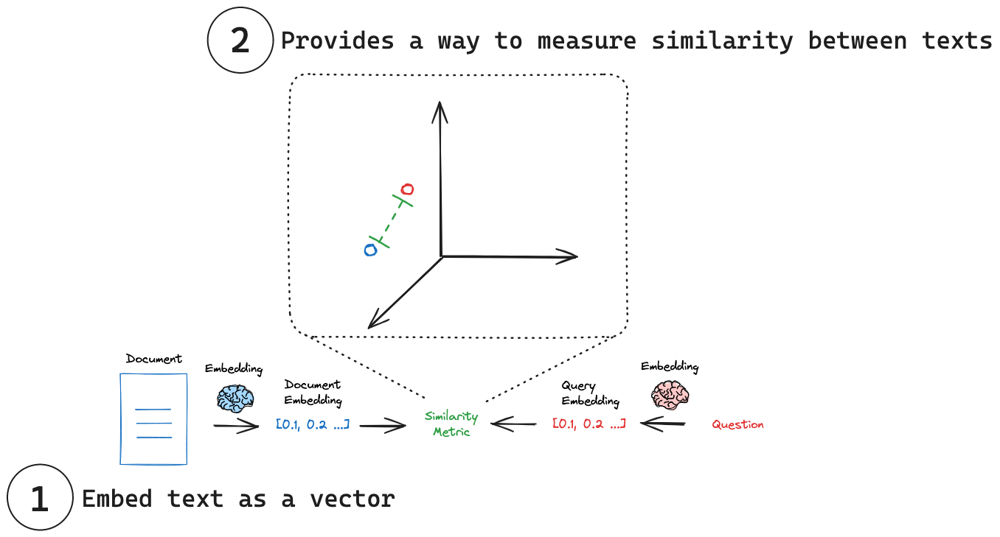

# RAG(Retrieval-Augmented Generation)

A typical RAG application has two main components:

通常一个RAG应用有两个主要部分

1. `Indexing`: a pipeline for ingesting data from a source and indexing it. *This usually happens offline.*

    `建立索引`: 从源获取数据并对其建立索引的管道。*这通常发生在离线状态*

2. `Retrieval and generation`: the actual RAG chain, which takes the user query at run time and retrieves the relevant data from the index, then passes that to the model.

    `检索和生成：`实际的RAG链，在运行时接收用户查询，从索引中检索相关数据，然后将其传递给模型。

## Indexing 建立索引


1. Load: First we need to load our data. This is done with `Document Loaders`. 加载：首先，我们需要加载数据。这是通过`文档加载`完成的。

    - `Document loaders` are designed to load document objects. `文档加载`指为了加载文档的对象。

2. Split: `Text splitters` break large `Documents` into smaller chunks. This is useful both for indexing data and passing it into a model, as large chunks are harder to search over and won’t fit in a model’s finite context window. 分割：`文本分割`将大的`文档`分割成更小的块。这对于索引数据和将其传递到模型中都很有用，因为大块更难搜索，也不适合模型的有限上下文窗口。

    - `Text splitters` `文本分割`

        Document splitting is often a crucial preprocessing step for many applications. It involves breaking down large texts into smaller, manageable chunks. This process offers several benefits, such as ensuring consistent processing of varying document lengths, overcoming input size limitations of models, and improving the quality of text representations used in retrieval systems. There are several strategies for splitting documents, each with its own advantages. 文档拆分通常是许多应用程序的关键预处理步骤。它涉及将大文本分解为更小、更易于管理的块。此过程提供了几个好处，例如确保对不同文档长度的一致处理，克服模型的输入大小限制，以及提高检索系统中使用的文本表示的质量。有几种拆分文档的策略，每种策略都有自己的优点。

    - Why split documents? 为什么拆分文档?

        There are several reasons to split documents: 拆分文档有几个原因：

        1. **Handling non-uniform document lengths:** Real-world document collections often contain texts of varying sizes. Splitting ensures consistent processing across all documents. **处理不一致的文档长度：** 现实世界中的文档集合通常包含不同大小的文本。拆分可确保所有文档的一致处理。
        2. **Overcoming model limitations:** Many embedding models and language models have maximum input size constraints. Splitting allows us to process documents that would otherwise exceed these limits. **克服模型限制：** 许多嵌入模型和语言模型都有最大输入大小限制。拆分允许我们处理超出这些限制的文档。
        3. **Improving representation quality:** For longer documents, the quality of embeddings or other representations may degrade as they try to capture too much information. Splitting can lead to more focused and accurate representations of each section. **提高描述质量：** 对于较长的文档，嵌入或其他描述的质量可能会降低，因为它们试图捕获太多的信息。拆分可以使每个部分的描述更加集中和准确。
        4. **Enhancing retrieval precision:** In information retrieval systems, splitting can improve the granularity of search results, allowing for more precise matching of queries to relevant document sections. **提高检索精度：** 在信息检索系统中，拆分可以提高搜索结果的粒度，使查询与相关文档部分更精确地匹配。
        5. **Optimizing computational resources:** Working with smaller chunks of text can be more memory-efficient and allow for better parallelization of processing tasks. **优化计算资源：** 使用较小的文本块可以提高内存效率，并允许更好地并行处理任务。

    - Length-based 基于长度

        The most intuitive strategy is to split documents based on their length. 最直观的策略是根据文档的长度对其进行拆分。

        Types of length-based splitting: 基于长度的拆分类型：

        Token-based: Splits text based on the number of tokens, which is useful when working with language models. 基于令牌：根据令牌的数量拆分文本，这在处理语言模型时很有用。
        Character-based: Splits text based on the number of characters, which can be more consistent across different types of text. 基于字符：根据字符数拆分文本，这可以在不同类型的文本中更加一致。

        ```js
        import { CharacterTextSplitter } from "@langchain/textsplitters";
        const textSplitter = new CharacterTextSplitter({
        chunkSize: 100,
        chunkOverlap: 0,
        });
        const texts = await textSplitter.splitText(document);
        ```

    - Text-structured based 基于文本结构

        Text is naturally organized into hierarchical units such as paragraphs, sentences, and words. 文本自然地组织成层次单位，如段落、句子和单词。

        ```js
        import { RecursiveCharacterTextSplitter } from "@langchain/textsplitters";

        const textSplitter = new RecursiveCharacterTextSplitter({
        chunkSize: 100,
        chunkOverlap: 0,
        });
        const texts = await textSplitter.splitText(document);
        ```

    - Document-structured based 基于文档结构

        Some documents have an inherent structure, such as HTML, Markdown, or JSON files. 一些文档天生具有结构，例如 HTML, Markdown, 或 JSON 文件

    - Semantic meaning based 基于语义

        Unlike the previous methods, semantic-based splitting actually considers the content of the text. 与之前的方法不同，基于语义的拆分实际上考虑了文本的内容。

3. Store: We need somewhere to store and index our splits, so that they can be searched over later. This is often done using a `VectorStore` and `Embeddings model`. 存储：我们需要一个地方来存储和索引我们的拆分，以便以后可以搜索它们。这通常是使用`矢量存储`和`嵌入模型`完成的。

    - Vector stores 矢量存储

        Vector stores are specialized data stores that enable indexing and retrieving information based on vector representations. 矢量存储是专门的数据存储，可以基于矢量表示对信息进行索引和检索。

        These vectors, called `embeddings`, capture the semantic meaning of data that has been embedded. 这些向量称为`嵌入`，捕获了嵌入数据的语义含义。

        Vector stores are frequently used to search over unstructured data, such as text, images, and audio, to retrieve relevant information based on semantic similarity rather than exact keyword matches. 矢量存储经常用于搜索非结构化数据，如文本、图像和音频，以基于语义相似性而不是精确的关键字匹配来检索相关信息。

        - Similarity metrics 相似度度量

            A critical advantage of embeddings vectors is they can be compared using many simple mathematical operations: 嵌入向量的一个关键优势是，它们可以使用许多简单的数学运算进行比较：

            Cosine Similarity: Measures the cosine of the angle between two vectors. 余弦相似度：测量两个向量之间角度的余弦。
            Euclidean Distance: Measures the straight-line distance between two points. 欧几里德距离：测量两点之间的直线距离。
            Dot Product: Measures the projection of one vector onto another. 点积：测量一个向量到另一个向量的投影。

        - Similarity search 相似度查询

            Given a similarity metric to measure the distance between the embedded query and any embedded document, we need an algorithm to efficiently search over all the embedded documents to find the most similar ones. 给定一个相似性度量来衡量嵌入式查询和任何嵌入式文档之间的距离，我们需要一种算法来有效地搜索所有嵌入式文档，以找到最相似的文档。There are various ways to do this. 有多种方法可以做到这一点。 As an example, many vector stores implement `HNSW` [(Hierarchical Navigable Small World)](https://www.pinecone.io/learn/series/faiss/hnsw/), a graph-based index structure that allows for efficient similarity search. 例如，许多向量库都实现了 `HNSW`（分层导航小世界），这是一种基于图的索引结构，可以实现高效的相似性搜索。

        - Metadata filtering 数据过滤

            While vector store implement a search algorithm to efficiently search over all the embedded documents to find the most similar ones, many also support filtering on metadata. 虽然矢量存储实现了一种搜索算法，可以有效地搜索所有嵌入式文档以找到最相似的文档，但许多还支持对元数据进行过滤。This allows structured filters to reduce the size of the similarity search space. 这允许结构化过滤器减小相似性搜索空间的大小。These two concepts work well together: 这两个概念配合得很好

            1. **Semantic search:** Query the unstructured data directly, often using via embedding or keyword similarity. 语义搜索：直接查询非结构化数据，通常通过嵌入或关键字相似度来实现。
            2. **Metadata search:** Apply structured query to the metadata, filtering specific documents. 元数据搜索：对元数据应用结构化查询，过滤特定文档。

    - Embedding models 嵌入模型

        Imagine being able to capture the essence of any text - a tweet, document, or book - in a single, compact representation.想象一下，能够在一个简洁的表示中捕捉任何文本的本质——推特、文档或书籍。 This is the power of embedding models, which lie at the heart of many retrieval systems. 这就是嵌入模型的力量，它是许多检索系统的核心。Embedding models transform human language into a format that machines can understand and compare with speed and accuracy. 嵌入模型将人类语言转换为机器可以理解的格式，并以速度和准确性进行比较。These models take text as input and produce a fixed-length array of numbers, a numerical fingerprint of the text's semantic meaning. 这些模型将文本作为输入，并产生一个固定长度的数字数组，即文本语义的数字指纹。Embeddings allow search system to find relevant documents not just based on keyword matches, but on semantic understanding.嵌入允许搜索系统不仅基于关键字匹配，而且基于语义理解来查找相关文档。

        

        (1) Embed text as a vector: Embeddings transform text into a numerical vector representation. 将文本嵌入为向量：嵌入将文本转换为数字向量表示。

        (2) Measure similarity: Embedding vectors can be comparing using simple mathematical operations. 度量相似性：嵌入向量可以使用简单的数学运算进行比较。

## Retrieval and generation 检索和生成

1. Retrieve: Given a user input, relevant splits are retrieved from storage using a Retriever. 检索：给定用户输入，使用检索器从存储中检索相关拆分。

2. Generate: A ChatModel / LLM produces an answer using a prompt that includes both the question with the retrieved data 生成：ChatModel/LLM使用包含问题和检索数据的提示生成答案


## RAG

RAG 是一种用于生成文本的技术，它结合了两个主要组件

- 检索（Retrieval）：这是一个从大型知识库或数据库中检索相关信息的过程。
- 生成（Generation）：这是一个使用检索到的信息来生成新文本的过程。

## 作用

1. 用户输入：用户输入一个提示或问题。
2. 检索：Langchain 的检索组件从知识库中检索相关信息。
3. 生成：Langchain 的生成组件使用检索到的信息来生成新文本。
4. 输出：生成的文本被输出给用户。
