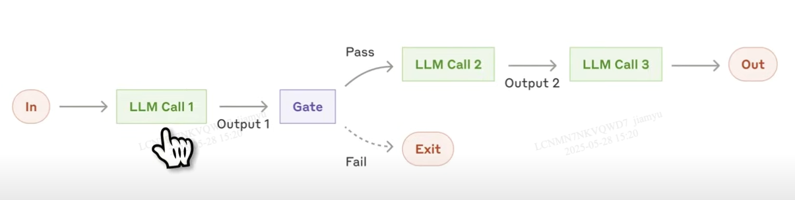
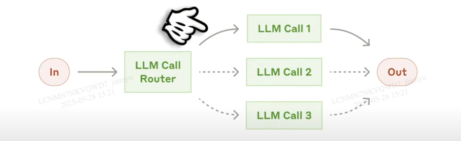

# Agent

why do we have multi agent systems?

why is it important to learn the components of AI agents ?

## models (o1,o3-mini, GPT-4o)

core intelligence capable of reasoning, making decisions, and processing different modalities.

## tools(function calling, web search, file search, MCP)

interface to the world, interact with environment, function calling, built-in tools

n8n

## knowledge and memory (vector store, file search, embedding)

augment agents with external and persistent knowledge

knowledge base(static memory)、persistent memory

## audio and speech (audio generation, realtime)

create agents that can understand audio and respond back in natural language

## guardrails (moderation, instruction, hierarchy)

prevent irrelevant, harmful, or undesirable behavior

## orchestration (agents sdk, tracing, evaluations, fine-tuning)

develop, deploy, monitor, and improve agents

### sub agent

#### prompt chaining

prompt chaining decomposes a task into a sequence of steps, where each LLM call processes the output of the previous one.

#### routing

routing classifies an input and directs it to a specialized followup task. this workflow allows for separation of concerns, and building more specialized prompts.

when to use this workflow: routing works well for complex tasks where there are distinct categories that are better handled separately, and where classification can be handled accurately, either by an LLM or a more traditional classification model/algorithm.

## 作用

1. 接收和处理输入：Agent 负责接收用户的输入
2. 调用语言模型：Agent 使用语言模型来生成响应或完成任务。
3. 生成响应：Agent 根据语言模型的输出生成响应或完成任务。
4. 与用户交互：Agent 可以与用户交互，例如通过对话式界面或命令行界面。
5. 管理会话状态：Agent 可以管理会话状态
