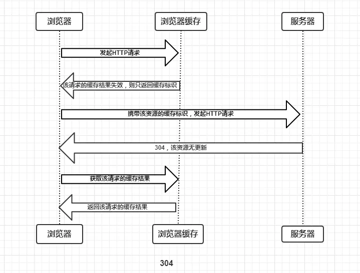
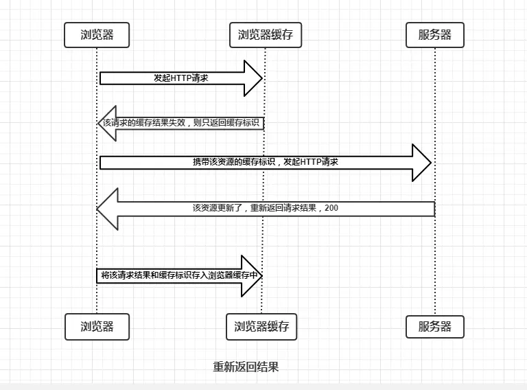
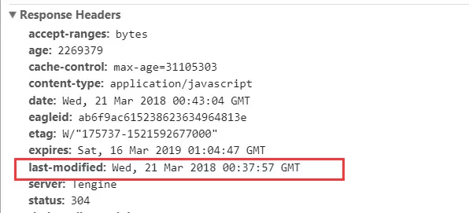
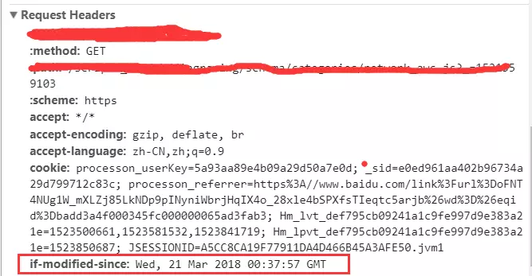
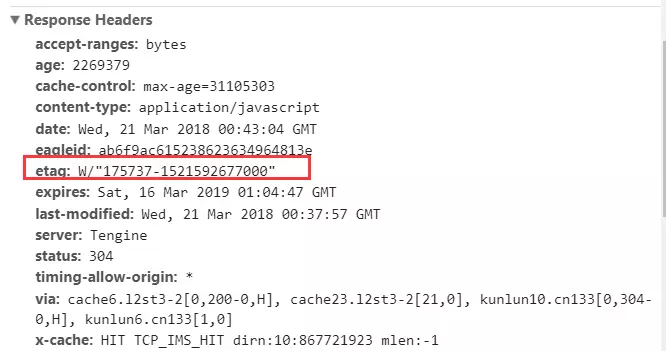
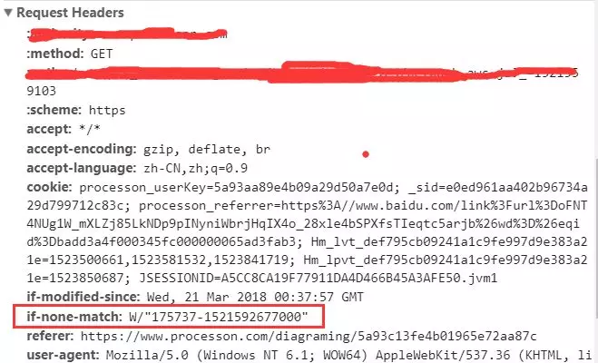

# 协商缓存

协商缓存就是强制缓存失效后，浏览器携带缓存标识向服务器发起请求，由服务器根据缓存标识决定是否使用缓存的过程，主要有以下两种情况：

协商缓存生效，返回 304，如下

协商缓存失效，返回 200 和请求结果结果，如下

同样，协商缓存的标识也是在响应报文的 HTTP 头中和请求结果一起返回给浏览器的，控制协商缓存的字段分别有：Last-Modified / If-Modified-Since 和 Etag / If-None-Match，其中 Etag / If-None-Match 的优先级比 Last-Modified / If-Modified-Since 高。

### Last-Modified / If-Modified-Since

Last-Modified 是服务器响应请求时，返回该资源文件在服务器最后被修改的时间，如下。

If-Modified-Since 则是客户端再次发起该请求时，携带上次请求返回的 Last-Modified 值，通过此字段值告诉服务器该资源上次请求返回的最后被修改时间。服务器收到该请求，发现请求头含有 If-Modified-Since 字段，则会根据 If-Modified-Since 的字段值与该资源在服务器的最后被修改时间做对比，若服务器的资源最后被修改时间大于 If-Modified-Since 的字段值，则重新返回资源，状态码为 200；否则则返回 304，代表资源无更新，可继续使用缓存文件，如下。

### Etag / If-None-Match

Etag 是服务器响应请求时，返回当前资源文件的一个唯一标识(由服务器生成)，如下。

If-None-Match 是客户端再次发起该请求时，携带上次请求返回的唯一标识 Etag 值，通过此字段值告诉服务器该资源上次请求返回的唯一标识值。服务器收到该请求后，发现该请求头中含有 If-None-Match，则会根据 If-None-Match 的字段值与该资源在服务器的 Etag 值做对比，一致则返回 304，代表资源无更新，继续使用缓存文件；不一致则重新返回资源文件，状态码为 200，如下。

注：Etag / If-None-Match 优先级高于 Last-Modified / If-Modified-Since，同时存在则只有 Etag / If-None-Match 生效。
