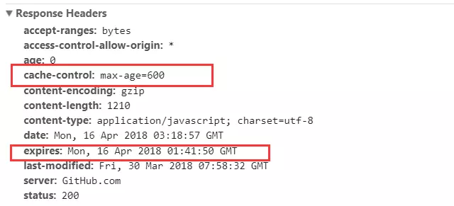
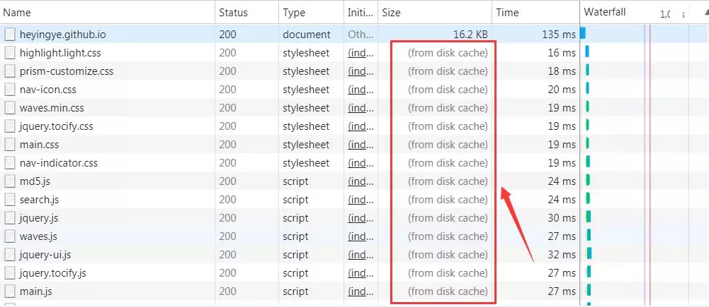

# 强制缓存

强制缓存就是向浏览器缓存查找该请求结果，并根据该结果的缓存规则来决定是否使用该缓存结果的过程，强制缓存的情况主要有三种(暂不分析协商缓存过程)

当浏览器向服务器发起请求时，服务器会将缓存规则放入 HTTP 响应报文的 HTTP 头中和请求结果一起返回给浏览器，控制强制缓存的字段分别是 Expires 和 Cache-Control，其中 Cache-Control 优先级比 Expires 高。

### Expires

Expires 是 HTTP/1.0 控制网页缓存的字段，其值为服务器返回该请求结果缓存的到期时间，即再次发起该请求时，如果客户端的时间小于 Expires 的值时，直接使用缓存结果。

> Expires 是 HTTP/1.0 的字段，但是现在浏览器默认使用的是 HTTP/1.1，那么在 HTTP/1.1 中网页缓存还是否由 Expires 控制？

到了 HTTP/1.1，Expire 已经被 Cache-Control 替代，原因在于 Expires 控制缓存的原理是使用客户端的时间与服务端返回的时间做对比，那么如果客户端与服务端的时间因为某些原因（例如时区不同；客户端和服务端有一方的时间不准确）发生误差，那么强制缓存则会直接失效，这样的话强制缓存的存在则毫无意义，那么 Cache-Control 又是如何控制的呢？

### Cache-Control

在 HTTP/1.1 中，Cache-Control 是最重要的规则，主要用于控制网页缓存，主要取值为：

- public：所有内容都将被缓存（客户端和代理服务器都可缓存）

- private：所有内容只有客户端可以缓存，Cache-Control 的默认取值

- no-cache：客户端缓存内容，但是是否使用缓存则需要经过协商缓存来验证决定

- no-store：所有内容都不会被缓存，即不使用强制缓存，也不使用协商缓存

- max-age=xxx (xxx is numeric)：缓存内容将在 xxx 秒后失效

接下来，我们直接看一个例子，如下：

由上面的例子我们可以知道：

- HTTP 响应报文中 expires 的时间值，是一个绝对值

- HTTP 响应报文中 Cache-Control 为 max-age=600，是相对值

由于 Cache-Control 的优先级比 expires 高，那么直接根据 Cache-Control 的值进行缓存，意思就是说在 600 秒内再次发起该请求，则会直接使用缓存结果，强制缓存生效。

注：在无法确定客户端的时间是否与服务端的时间同步的情况下，Cache-Control 相比于 expires 是更好的选择，所以同时存在时，只有 Cache-Control 生效。

了解强制缓存的过程后，我们拓展性的思考一下：

> 浏览器的缓存存放在哪里，如何在浏览器中判断强制缓存是否生效？

这里我们以博客的请求为例，状态码为灰色的请求则代表使用了强制缓存，请求对应的 Size 值则代表该缓存存放的位置，分别为 from memory cache 和 from disk cache。

> 那么 from memory cache 和 from disk cache 又分别代表的是什么呢？什么时候会使用 from disk cache，什么时候会使用 from memory cache 呢？

from memory cache 代表使用内存中的缓存，from disk cache 则代表使用的是硬盘中的缓存，浏览器读取缓存的顺序为 memory –> disk。

虽然我已经直接把结论说出来了，但是相信有不少人对此不能理解，那么接下来我们一起详细分析一下缓存读取问题，这里仍让以我的博客为例进行分析：

访问https://heyingye.github.io/ –> 200 –> 关闭博客的标签页 –> 重新打开https://heyingye.github.io/ –> 200(from disk cache) –> 刷新 –> 200(from memory cache)

过程如下：

- 访问https://heyingye.github.io/

- 关闭博客的标签页

- 重新打开https://heyingye.github.io/

- 刷新

> 看到这里可能有人小伙伴问了，最后一个步骤刷新的时候，不是同时存在着 from disk cache 和 from memory cache 吗？

对于这个问题，我们需要了解内存缓存(from memory cache)和硬盘缓存(from disk cache)，如下:

- 内存缓存(from memory cache)：内存缓存具有两个特点，分别是快速读取和时效性：

- 快速读取：内存缓存会将编译解析后的文件，直接存入该进程的内存中，占据该进程一定的内存资源，以方便下次运行使用时的快速读取。

- 时效性：一旦该进程关闭，则该进程的内存则会清空。

- 硬盘缓存(from disk cache)：硬盘缓存则是直接将缓存写入硬盘文件中，读取缓存需要对该缓存存放的硬盘文件进行 I/O 操作，然后重新解析该缓存内容，读取复杂，速度比内存缓存慢。

在浏览器中，浏览器会在 js 和图片等文件解析执行后直接存入内存缓存中，那么当刷新页面时只需直接从内存缓存中读取(from memory cache)；而 css 文件则会存入硬盘文件中，所以每次渲染页面都需要从硬盘读取缓存(from disk cache)。
