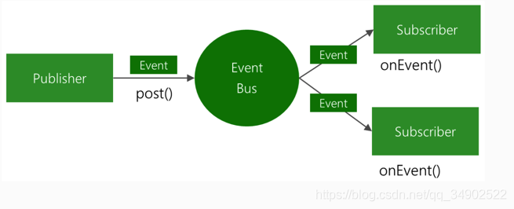

# eventbus

eventbus主要有以下几部分组成：

1、eventbus、asyncEventBus：事件发送器。

2、event：事件承载单元。

3、SubscriberRegistry：订阅者注册器，将订阅者注册到event上，即将有注解Subscribe的方法和event绑定起来。

4、Dispatcher：事件分发器，将事件的订阅者调用来执行。

5、Subscriber、SynchronizedSubscriber：订阅者，并发订阅还是同步订阅。
