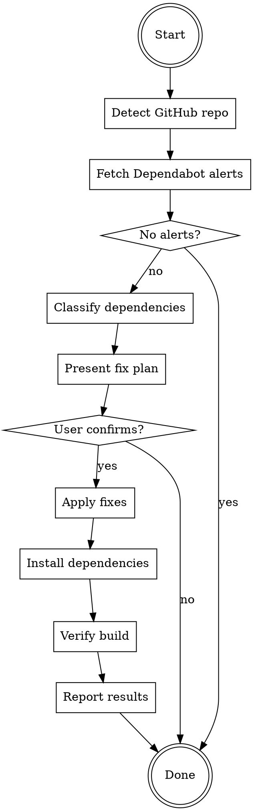

# Fix Security Alerts

## Overview

Fetch open critical and high severity Dependabot alerts from GitHub, analyze the dependency tree, propose a fix plan, and apply fixes after user confirmation.

## Workflow



## Steps

### 1. Detect GitHub repo info

```bash
# Get the GitHub remote URL to extract owner/repo
git remote get-url origin
```

- Parse `owner/repo` from the remote URL
- Determine the GitHub hostname (e.g., `github.com`)

### 2. Fetch Dependabot alerts

```bash
# Fetch open critical and high severity alerts
gh api repos/{owner}/{repo}/dependabot/alerts \
  --hostname {hostname} \
  --jq '.[] | select(.security_advisory.severity == "critical" or .security_advisory.severity == "high") | select(.state == "open") | {number, severity: .security_advisory.severity, package: .security_vulnerability.package.name, ecosystem: .security_vulnerability.package.ecosystem, vulnerable_range: .security_vulnerability.vulnerable_version_range, patched: .security_vulnerability.first_patched_version.identifier, summary: .security_advisory.summary}'
```

- If no open critical/high alerts, inform the user and stop
- If `gh` auth fails, ask user to run `gh auth login`

### 3. Classify dependencies

For each vulnerable package, determine if it is:

- **Direct dependency**: listed in `dependencies` or `devDependencies` in `package.json`
- **Indirect (transitive) dependency**: pulled in by another package

Use the package manager's `why` command to trace the dependency tree:

```bash
# npm
yarn why {package_name}
# or
npm ls {package_name}
```

### 4. Present fix plan to user

Display a table with:

| Package | Current Version | Fix Version | Dependency Type | Fix Method |
|---------|----------------|-------------|-----------------|------------|

Fix methods:
- **Direct upgrade**: bump version in `package.json` for direct dependencies
- **Resolutions/overrides**: use `resolutions` (yarn) or `overrides` (npm) for indirect dependencies

**IMPORTANT**: Wait for user confirmation before proceeding. Do NOT apply fixes without approval.

### 5. Apply fixes

- **Direct dependencies**: update the version in `package.json`
- **Indirect dependencies**: add entries to `resolutions` (yarn) or `overrides` (npm) in `package.json`
- Be careful with major version bumps across different semver ranges (e.g., minimatch v3 vs v9) — do NOT force all to one major version

### 6. Install dependencies

```bash
yarn install
# or
npm install
```

### 7. Verify build

Run the project's quality checks to ensure no breaking changes:

```bash
# Adapt to the project's available scripts
yarn type:check   # TypeScript check
yarn lint          # Linting
yarn build         # Build (optional, if quick)
```

- If verification fails, investigate and fix the issue
- If a fix introduces breaking changes, inform the user with details

### 8. Report results

Display a summary table of what was fixed:

| Package | Before | After | Method |
|---------|--------|-------|--------|

## Rules

- **NEVER** apply fixes without presenting the plan and getting user confirmation first
- **NEVER** blindly force all versions of a package to one major version (respect semver ranges)
- **NEVER** downgrade packages
- Always verify the build passes after applying fixes
- If a vulnerable package cannot be safely upgraded (e.g., major breaking change), inform the user and suggest alternatives (e.g., waiting for upstream fix, replacing the package)
- Do NOT commit changes — let the user decide when to commit
